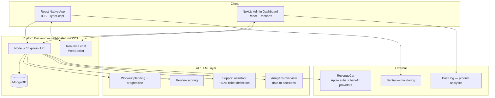

# Tsemppi — AI Workout App (Case Study)

> A production iOS app and admin platform I co-founded and lead the development on.
> **#1 most-downloaded in Finland** on the App Store (now top 50), **4.9★**, **2,700+ users**, **~110% growth in active paying subscribers over 90 days**.

**Live:** [App Store](https://apps.apple.com/us/app/tsemppi-workout-coach/id6757228735) · [tsemppiapp.fi](https://tsemppiapp.fi/)

> This is a documentation-only case study. The source is private because Tsemppi is a live commercial product. This repo shows how it's built and what I own.

---

## The problem
People start a workout app, get overwhelmed on the first screens, and never reach a real routine. The product had to onboard fast, plan intelligently, and keep users engaged, while the tiny founding team needed the tooling to see what was actually happening and act on it.

## My role
Co-founder and lead developer on a three-person founding team. I own the app, the full backend, the payment system, the admin dashboard, and every AI feature. I direct a second developer and work with a designer.

---

## Architecture

---

## Key features I built

**Mobile app (React Native, TypeScript)**
The user-facing iOS app: AI-generated workout plans with smart progression, and an AI that reviews a routine and scores how good it is, wired end to end from backend services to the interface.

**Custom backend (Node.js on a VPS)**
APIs, data flows, and multi-device sync, all self-hosted and maintained by me. Monitored with Sentry so I catch and fix issues from real usage.

**Admin dashboard (Next.js / React)**
Real-time agent-and-customer chat with typing indicators on both ends, subscription and user analytics, activation funnels, and retention charts in Recharts. This is effectively agent tooling: the same shape as an internal investigator or support console, pointed at our own support and growth.

**AI / LLM features in production**
- **Support assistant** that knows the app and resolves ~40% of tickets before they reach a human, routing the rest with context.
- **Analytics overview** that pulls all the dashboard data together and recommends what to act on next.
- **Multi-model** design across current GPT and Gemini Flash models, choosing the right model per job for cost versus quality.

**Payments**
My own RevenueCat system: Apple subscriptions plus Finnish wellness-benefit providers (Edenred, ePassi, Smartum).

---

## A decision I'm proud of
My analytics AI flagged a drop-off between the first onboarding screen and registration, pointing at one screen with too many profile options. I had built that screen, but the data was clear, so I cut it to a single public/private toggle. Drop-off fell and more users made it through. The AI found it, I decided the fix, the data confirmed it. Customer over ego.

---

## Results
- **#1 most-downloaded in Finland** on the App Store (now top 50)
- **4.9★** rating
- **2,700+ users**, 1,000+ new in a recent 28-day window
- **~110% growth** in active paying subscribers over 90 days
- Trial-to-paid ~33%

## Stack
`React Native` · `TypeScript` · `Next.js` · `React` · `Node.js` · `Express` · `MongoDB` · `WebSocket` · `RevenueCat` · `LLM (GPT, Gemini Flash)` · `Recharts` · `Sentry` · `PostHog`
