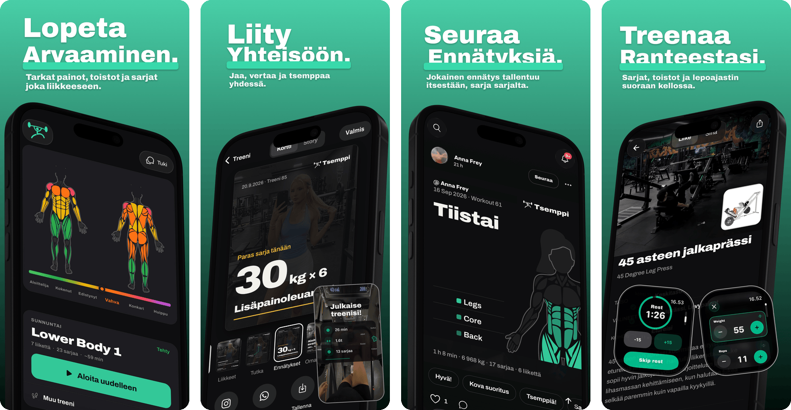

# Tsemppi

Tsemppi is a strength-training app for iPhone, Android, Apple Watch and Wear OS. I co-founded it in a team of three and I lead development: 418 of the 421 commits on the app's main branch are mine. As of 26 September 2026, 3,756 people have completed sign-up and 1,319 used the app in the last 30 days, logging 32,298 sets between them.

It is on the [App Store](https://apps.apple.com/fi/app/id6757228735?l=en) and [Google Play](https://play.google.com/store/apps/details?id=com.tsemppi.app), and the website is [tsemppiapp.fi](https://tsemppiapp.fi). The code is private because Tsemppi is a live commercial product, so this repository is documentation only.

Written by Kenneth Minkinen. I'm half Estonian and half Finnish, an EU citizen relocating to Tallinn, and I'm looking for full-stack or product engineering work there. I can walk through any part of the code on a call. Message me on [LinkedIn](https://www.linkedin.com/in/kenneth-minkinen-118643281/).

Left to right: the strength map on the home screen, a live workout that has just logged a record, and the progress index with recovery. The UI is Finnish, and the frames come from the demo videos on tsemppiapp.fi.

## The product

The app builds a training plan, sets the load for every session, logs the workout and tracks progress per muscle group. Around that sit a community feed, a GPS run recorder, weight tracking and an in-app support chat. Almost all users are in Finland (98% of sign-ups).

The interface ships in Finnish, English, Swedish, Danish and Norwegian, with 8,302 strings in each, and the 448-exercise catalogue is written in all five. The app is free to download, and the subscription is €9.99 a month or €69.99 a year.

## My role

I lead development, and the app repository is my work apart from 3 commits by my co-founder Pietari Risku. That covers the React Native app, the Swift and Kotlin code, the Node API and its worker, payments, push and email. I also run the Linux server the API lives on and do the deploys.

The website is a separate repository that Pietari owns. In it I built the admin dashboard: 11 pages and about 12,500 lines, 99.5% of them mine by `git blame`.

## Architecture

- App: JavaScript on Expo SDK 57 and React Native 0.86, with React 19.2 and the React Compiler on. It uses expo-router with typed routes, Zustand, MMKV v4 and Reanimated 4, and one codebase serves iOS and Android. The native code sits behind three local Expo modules and five config plugins.
- iOS native, in Swift: a watchOS app that runs a HealthKit workout session (`HKWorkoutSession` with `HKLiveWorkoutBuilder`) plus 4 watch widgets, 10 home-screen widgets, 4 Live Activities, a Control Center control, and a notification service extension that adds avatars and media to pushes. The server starts the "today's workout" Live Activity with push-to-start.
- Android native, in Kotlin: a Wear OS app on Health Services (`ExerciseClient`) with tiles and complications, ongoing notifications for workouts, runs and rest timers, 8 home-screen widgets rendered from JSX, and Health Connect.
- API: Node with Express 5 and Mongoose 9 on MongoDB. About 250 HTTP endpoints in 20 route files, 25 models, and socket.io for the live support chat.
- Worker: the same code started with `ROLE=worker`. It is the only process that runs the 25 scheduled jobs, and the API process only serves HTTP. Both run under PM2 on a Linux server I manage.
- Deploys: `scripts/deploy.sh` rsyncs a `git archive` of HEAD, so only committed code reaches the server, then runs a health check. The app is also set up for over-the-air JavaScript updates with EAS Update, and the publish script uploads sourcemaps to Sentry.
- Payments: RevenueCat, with a server webhook and promotional grants through its REST API. Employer sport benefits (ePassi, Edenred) work by receipt: the user uploads it, an admin approves it, and the server grants the entitlement.
- Admin dashboard: Next.js 16, React 19.2 and Recharts 3. Its support page is a live chat with typing indicators on both sides, and the in-app assistant can pass a conversation to it through a `handoff_to_human` tool that carries a reason and a summary. Other pages cover an activation funnel graded against targets, promo and creator codes with commissions tracked to the cent, push open rates by type, community moderation, and a weekly digest a model writes from the week's metrics.
- Other services: OpenAI `gpt-5.4-mini` (plan generation, plan edits, support answers, the weekly digest), Expo push, Resend for email, Google Cloud Storage, and PostHog and Sentry in both the app and the server.

## Engineering notes

### Load progression and the prescription ledger

The first progression engine could raise a load but never lower it. The current one (`utils/progressionEngine.js`) turns each finished session into the next prescription in six stages, and a tested invariant stops a single session from moving a weight by more than one equipment increment. A ledger stores what the engine told the user to lift next to what they actually lifted, and that gap calibrates the engine. The app also commits to a number before a lift and grades itself afterwards: it reports hits with their denominator, says nothing until it has 5 judged predictions, and lets a prediction expire uncounted after 21 days if the lift never happened.

### Replacing a model's score with arithmetic

Routine analysis used to ask a model for a 1-10 score, and the score was not reproducible. I replaced it with a pure function, `lib/routineVolume.js`, that counts weekly effective sets per muscle against evidence-based ranges. The same file runs in the app (offline, on the first frame) and on the server. The model now only writes a short note, and the server refuses to return the note unless every number in it was already computed.

### Editing a plan with one sentence

A user can change their plan by typing a sentence. The model sees the plan's rows only as refs (`r1`..`rN`) and returns at most 8 intents through a strict JSON schema, which the server validates field by field. It never names an exercise or writes a row. The app applies each intent through the plan screen's own draft operations, so the edit can be undone, and user text only ever travels as JSON inside the user message.

### Messaging rules

Quiet hours hold a deferrable push until the window ends and drop a time-bound one, and every gate is checked again at delivery (`services/deferredPush.js` flushes every 4 minutes). After a scheduled job once pushed to the whole user base, I added a daily circuit breaker on distinct recipients. Lifecycle email had grown into 11 rescue crons, 3 re-engagement crons and a missed-schedule email. In September 2026 I merged a rebuild that replaces them with one postmaster, which decides once a day, per person, whether any email or nudge push goes out. Each of its 54 message keys carries a class, consent stream, send window and priority, and each class holds out 10% of people.

### GPS distance that errs short

Raw phone GPS inflates distance by 5-15%, and most of that comes from standing still: consecutive fixes wander 2 to 5 m, so a wait at a crossing adds distance nobody ran. `utils/gpsTrack.js` is a pure reducer with three gates. Fixes with an accuracy worse than 25 m are dropped first. A step then counts only when it is more than twice the fix's reported accuracy, and at least 5 m, because two readings of the same spot can sit up to twice the error apart; a gate at 1x lets that jitter through. A speed gate drops teleports. The bias that remains is slightly short, which is the safer direction for a run log, and the tests replay fabricated traces with no device.

### Weight as a trend

Scale readings are noisy, so the app shows an exponentially weighted trend with a 7-day half-life. The smoothing weight depends on the gap between entries (`1 - 2^(-gap/halfLife)`), so someone who weighs in daily and someone who weighs in weekly get the same smoothing per real day. The rate is a least-squares slope of the trend over 28 days, and on purpose there is no projected arrival date. `lib/weightCore.js` is shared by the app and the server.

### Nordic search folding

Exercise search folded accents with Unicode NFD, but ø and æ have no NFD decomposition, so the folder deleted them and split words on them. A Danish user typing "loft" for "løft" got 0 hits, and so did a Norwegian typing "boy" for "bøy". Mapping the letters explicitly took those searches to 43 and 78 hits. The index builds lazily, because building it takes about 250 ms.

### Comparing two lifters fairly

The "you vs them" screen used to compare raw kilograms. `lib/fairCompare.js` scores each lift against per-exercise strength ladders for men and women (340 of the 448 exercises have them) and uses bodyweight-relative standards where they fit. For lifters aged 40 and over it applies the McCulloch masters age coefficients, on lifts measured in kg only. I rejected DOTS and Wilks, and the file documents why.

## Tests and releases

- 749 test files: 589 in the app's Jest project (jest-expo) and 160 in the server's (Node). A grep finds about 11,800 test cases before 401 `it.each` tables expand.
- Server tests run against an in-memory MongoDB (77 files), and 46 files drive the Express app over HTTP with supertest.
- The pre-commit hook runs the full Jest suite. CI on GitHub Actions runs on every pull request and push to main: ESLint with zero errors and a ratcheting warning cap, a type-check, and the tests. The type-checked JavaScript is the server core (`lib/server`, with `checkJs`).
- 11 App Store releases between 12 February and 22 September 2026.

## Product decisions

The analysis page in our admin dashboard flagged a drop-off between the first onboarding screen and registration, and pointed at one screen with too many profile options. I had built that screen. I cut it to a single public/private toggle, and drop-off fell.

The streak used to count days, so it grew while people rested. It now counts consecutive training weeks. A week counts once you are within one session of your weekly target, and the week in progress can never break the streak.

The progress index runs from 1.0 to 6.0 over 8 muscle groups. It now falls when training stops, with the peak kept beside it. Untrained groups count as 1.0, so starting to train a new group can never lower it.

## Results

- 3,756 people have completed sign-up since 26 February 2026, the first day the event was recorded. 98% are in Finland and 61% are on iOS.
- The best 28 days brought 1,348 sign-ups (26 March to 22 April 2026).
- 1,319 people used the app in the last 30 days, and 527 in the last 7.
- 5,725 workouts completed since 15 April 2026, when that event was added.
- Trial to paid was 34%: 26 of the 76 trials that started between 25 August and 15 September 2026, counted from the RevenueCat webhook.
- 4.2 out of 5 from 30 ratings on the Finnish App Store, and 4.4 from 24 reviews on Google Play, where it has passed 1,000 downloads.
- Tsemppi reached #1 most-downloaded in Finland on the App Store.

Usage figures are PostHog queries and store figures are the public listings, both from 26 September 2026. Code figures are from the repository at commit 628ed1e.

## Stack

| Part | Tools |
|---|---|
| App | JavaScript, React Native 0.86, Expo SDK 57, React 19.2, expo-router, Zustand, MMKV, Reanimated 4, FlashList 2 |
| Native | Swift (widgets, Live Activities, watchOS, HealthKit), Kotlin (Wear OS, Health Services), Health Connect |
| Server | Node, Express 5, Mongoose 9, MongoDB, socket.io, node-cron, PM2 |
| Admin | Next.js 16, React 19.2, Tailwind 4, Recharts 3, socket.io-client |
| Services | RevenueCat, OpenAI, Expo push, EAS Update, Resend, Google Cloud Storage, PostHog, Sentry |
| Tests and CI | Jest, supertest, mongodb-memory-server, ESLint, husky, GitHub Actions |

My other app, Ravinne, is a nutrition tracker I built alone. It is written up in [ravinne-case-study](https://github.com/KennethMin/ravinne-case-study).
